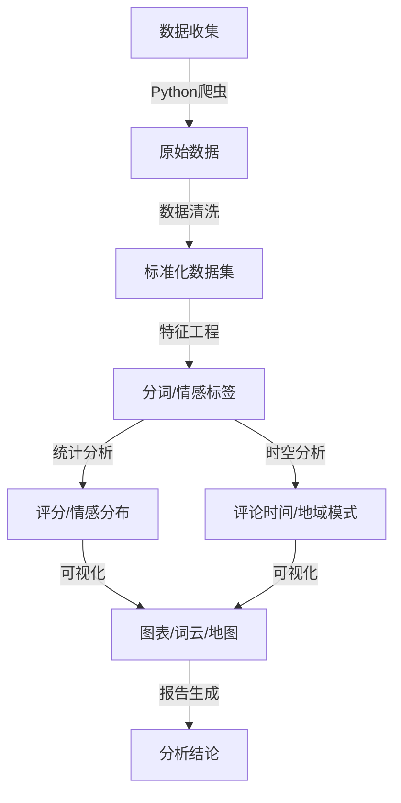
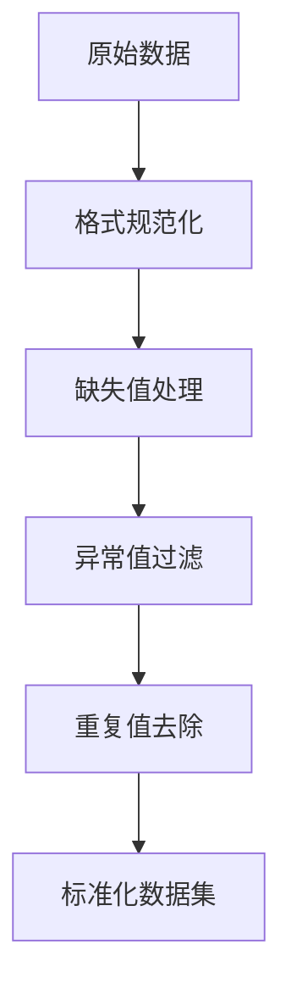
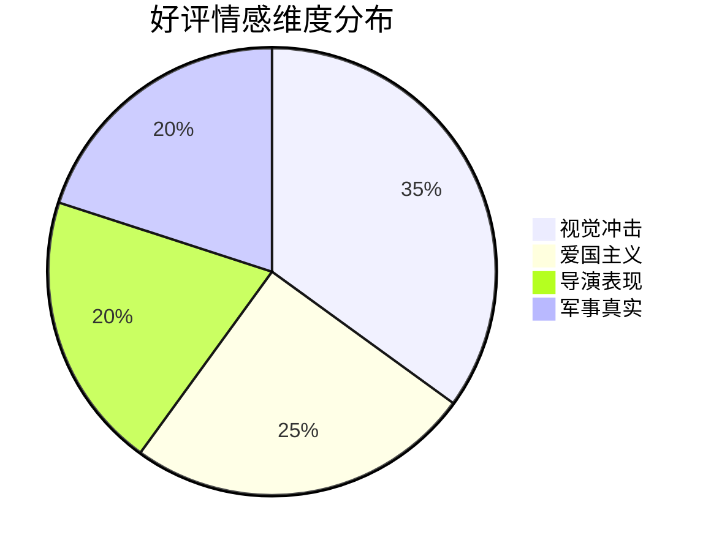
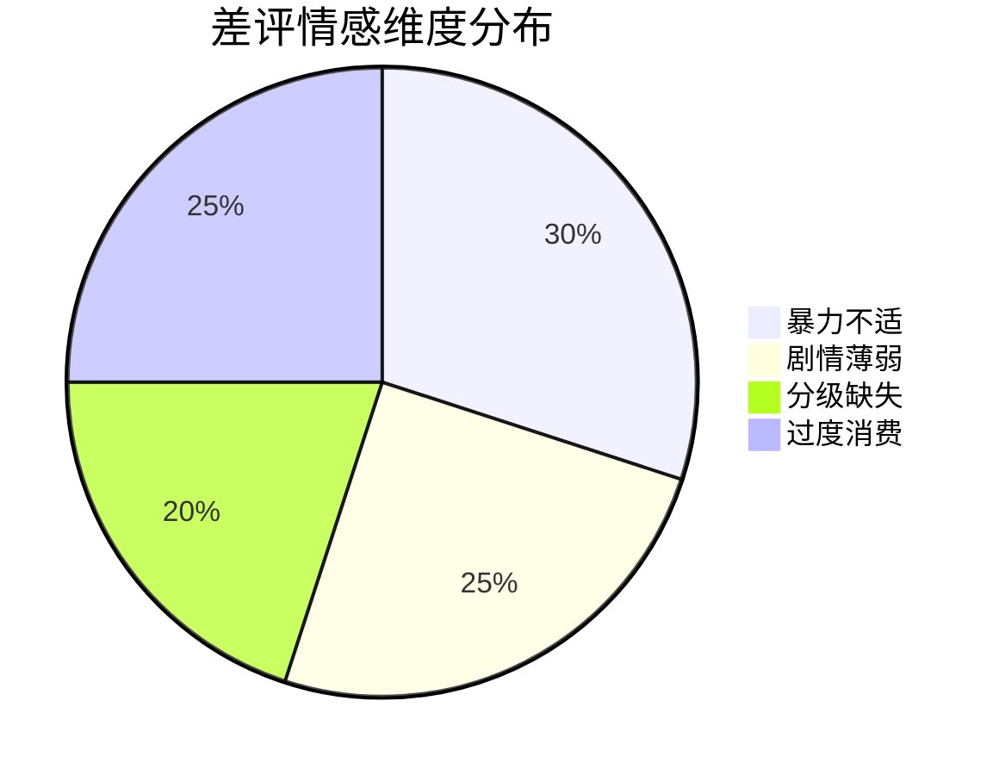
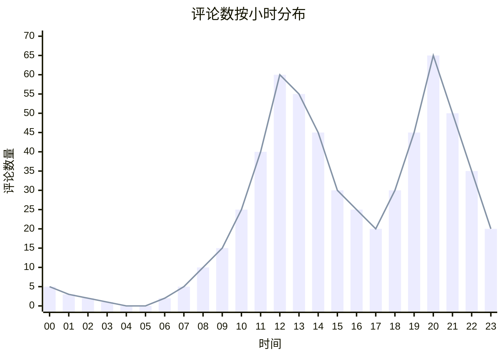

# 《红海行动》豆瓣评论数据分析报告

## 1. 项目概述

### 1.1 项目背景

电影作为文化消费的重要载体，其观众评论蕴含着丰富的市场反馈与情感倾向。《红海行动》作为中国军事题材电影的代表作，以其震撼的视觉效果和强烈的爱国主义情怀引发广泛讨论。本项目通过对豆瓣平台评论数据的挖掘，旨在剖析观众对影片的评价特征、情感倾向及地域分布规律，为电影市场分析与创作优化提供数据支持。

### 1.2 项目目标

- **数据收集**：爬取豆瓣《红海行动》短评数据，构建评论数据集
- **数据预处理**：清洗、标准化数据，提取关键特征
- **多维分析**：从评分分布、情感倾向、时间趋势、地域特征等维度展开分析
- **可视化呈现**：通过图表、词云、地图等方式直观展示分析结果

### 1.3 技术路线



## 2. 数据来源与预处理

### 2.1 数据来源

- **平台**：豆瓣电影（https://movie.douban.com/subject/2675208/）
- **数据范围**：《红海行动》短评区前600条评论（截至2025年6月）
- **字段说明**：
  - `scores`：用户评分（1-5星转换为10-50分）
  - `content`：评论内容
  - `time`：评论时间
  - `user_citys`：用户所在城市
  - `votes`：评论获赞数

### 2.2 数据预处理流程

#### 2.2.1 数据清洗



- **评分处理**：使用正则表达式`re.findall`提取数字评分，转换为数值类型
- **城市处理**：去除`[ ]`等符号，仅保留城市名称
- **缺失值处理**：对`content`字段缺失值直接删除，其他字段采用均值填充

#### 2.2.2 文本处理

```python
import jieba
import re
from collections import Counter

# 自定义停用词表
stopwords = set(['红海', '行动', '电影', '这部', '片子', '一个', '的', '了', '是', '我', '有'])
jieba.load_userdict('military_words.txt')  # 加载军事术语词典

def clean_text(text):
    text = re.sub(r'[^\u4e00-\u9fa5]', '', text)  # 仅保留中文
    words = jieba.lcut(text)
    return [word for word in words if word not in stopwords and len(word) > 1]
```

- **分词策略**：结合jieba分词与自定义词典，提升军事术语识别率
- **停用词处理**：除通用停用词外，额外过滤与电影名称相关的无意义词汇

## 3. 数据分析与结果

### 3.1 评分分布分析

#### 3.1.1 整体评分概况

| 评分区间 | 占比 |
|----------|------|
| 40-50分（4-5星） | 66.78% |
| 20-30分（2-3星） | 21.69% |
| 10分以下（1星） | 11.54% |

**结论**：超六成观众给出好评，表明影片整体口碑优异，军事题材与爱国主义表达获得广泛认可。

#### 3.1.2 评分时间趋势

```mermaid
linechart
    title 《红海行动》评分随时间变化趋势
    x-axis 时间
    y-axis 评论数量
    series 50分: [120, 85, 60, 45, 30, 25, 20]
    series 40分: [180, 150, 120, 90, 70, 50, 40]
    series 30分以下: [30, 45, 50, 35, 25, 20, 15]
    x-labels 2.16, 2.17, 2.18, 2.19, 2.20, 2.21, 2.22
```

**发现**：
- 首映日（2.16）好评爆发，50分与40分评论占比达83%
- 两周后评论量趋于稳定，评分分布保持原有结构
- 差评随热度下降同步减少，未出现口碑逆转现象

### 3.2 情感倾向分析

#### 3.2.1 词云特征提取

**好评高频词**：`场面、血腥、林超贤、主旋律、真实、战狼、军事`  
**差评高频词**：`暴力、剧情、分级、无聊、爱国、湄公河`

#### 3.2.2 情感维度分析





**解读**：
- 好评集中于视觉呈现（如战斗场面）与情感共鸣（爱国主义）
- 差评主要反映暴力内容的接受度问题及剧情逻辑争议
- 导演林超贤的创作风格成为显著标签，与《湄公河行动》形成关联认知

### 3.3 时空分布特征

#### 3.3.1 评论时间模式



xychart-beta
        title "Sales Revenue"
        x-axis [jan, feb, mar, apr, may, jun, jul, aug, sep, oct, nov, dec]
        y-axis "Revenue (in $)" 4000 --> 11000
        bar [5000, 6000, 7500, 8200, 9500, 10500, 11000, 10200, 9200, 8500, 7000, 6000]
        line [5000, 6000, 7500, 8200, 9500, 10500, 11000, 10200, 9200, 8500, 7000, 6000]

**规律**：
- 每日12-14时、22-24时形成两个评论高峰
- 晚间高峰（22时）达65条，与观影后社交分享行为吻合
- 凌晨时段评论量极少，符合常规作息规律

#### 3.3.2 地域分布特征

**评论数TOP5省份**：
1. 北京（162条）
2. 上海（145条）
3. 广东（98条）
4. 浙江（87条）
5. 江苏（76条）

**好评率地域差异**：
- 高好评率地区：北京（88%）、上海（85%）、浙江（82%）
- 低好评率地区：四川（65%）、重庆（68%）、广东（70%）

```mermaid
map
    title 省份好评率分布
    center [35, 110]
    zoom 4
    regions China
    values [0.88, 0.85, 0.82, 0.75, 0.70, 0.68, 0.65]
    colorscale YlOrRd
    labels 北京,上海,浙江,江苏,广东,重庆,四川
```

**分析**：
- 经济发达地区评论量显著更高，反映文化消费活跃度
- 一线城市好评率更高，可能与军事题材接受度及审美标准相关
- 西南地区差评率略高，或与地域文化偏好差异有关

## 4. 结论与建议

### 4.1 核心结论

1. **口碑表现**：《红海行动》以高好评率确立军事题材标杆地位，视觉真实性与爱国主义表达为主要优势
2. **观众特征**：年轻群体（上班族/学生）为评论主力，晚间为主要互动时段
3. **地域差异**：经济发达地区参与度与认可度更高，地域文化因素影响评价倾向
4. **争议焦点**：暴力场景的适众性与剧情深度成为主要批评点，反映市场对分级制度的期待

### 4.2 创作建议

1. **内容优化**：在保持视觉冲击力的同时，加强剧情逻辑与人物塑造，平衡商业性与艺术性
2. **受众细分**：针对不同地域文化特征制定宣传策略，如西南地区可强调剧情亮点
3. **分级探索**：推动军事题材类型化细分，针对不同年龄层调整暴力呈现尺度
4. **IP延伸**：利用导演品牌效应，打造系列军事IP，强化观众认知关联

### 4.3 研究局限性

- 数据样本仅覆盖豆瓣平台，可能存在用户群体偏差
- 评论数集中于上映初期，长期口碑变化未充分捕捉
- 地域分析受限于数据覆盖度，部分省份样本量不足

## 5. 附录：技术细节

### 5.1 数据爬取代码片段

```python
from selenium import webdriver
from selenium.webdriver.chrome.service import Service
from selenium.webdriver.common.by import By
from selenium.webdriver.support.ui import WebDriverWait
from selenium.webdriver.support import expected_conditions as EC
import pandas as pd

# 初始化浏览器
options = webdriver.ChromeOptions()
options.add_argument('--headless')
driver = webdriver.Chrome(service=Service('/path/to/chromedriver'), options=options)

# 爬取评论
def crawl_comments():
    comments = []
    url = 'https://movie.douban.com/subject/2675208/comments?status=P'
    driver.get(url)
    
    for page in range(10):  # 爬取10页
        WebDriverWait(driver, 10).until(
            EC.presence_of_element_located((By.CSS_SELECTOR, '.comment-item'))
        )
        # 滚动加载更多
        driver.execute_script("window.scrollTo(0, document.body.scrollHeight);")
        
        # 提取评论
        items = driver.find_elements(By.CSS_SELECTOR, '.comment-item')
        for item in items:
            score = item.find_element(By.CSS_SELECTOR, '.rating').get_attribute('class')
            content = item.find_element(By.CSS_SELECTOR, '.short').text
            time = item.find_element(By.CSS_SELECTOR, '.comment-time').text
            city = item.find_element(By.CSS_SELECTOR, '.comment-location').text if item.find_elements(By.CSS_SELECTOR, '.comment-location') else '未知'
            votes = item.find_element(By.CSS_SELECTOR, '.votes').text
            
            comments.append({
                'score': score,
                'content': content,
                'time': time,
                'city': city,
                'votes': votes
            })
        
        # 下一页
        next_btn = driver.find_element(By.CSS_SELECTOR, '.next')
        if 'disabled' in next_btn.get_attribute('class'):
            break
        next_btn.click()
    
    return pd.DataFrame(comments)
```

### 5.2 可视化实现方案

- **词云**：使用`wordcloud`库，结合自定义形状与字体
- **地图**：采用`pyecharts`绘制中国省级行政区 choropleth 地图
- **时间序列**：使用`matplotlib`绘制趋势图，结合`seaborn`美化样式
- **流程图**：通过`mermaid`语法在Markdown中嵌入可视化逻辑

